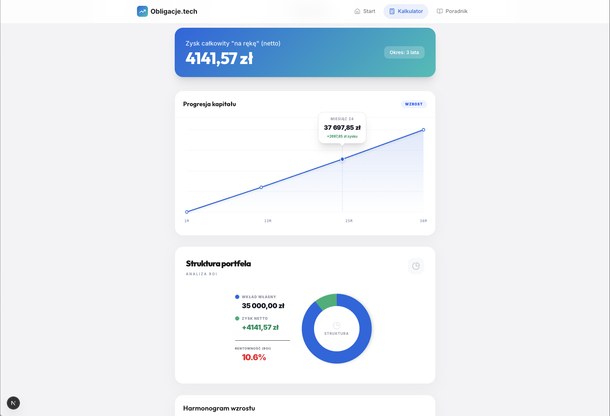
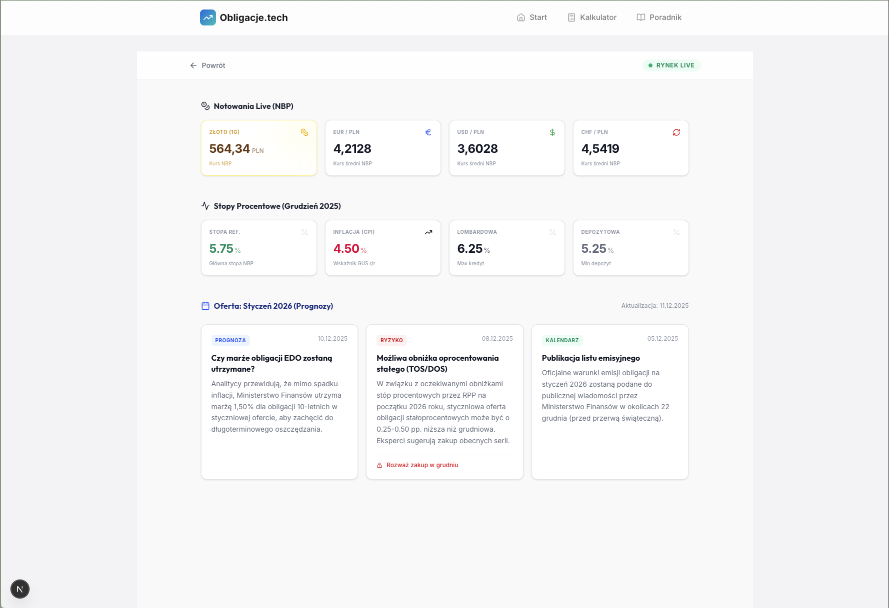
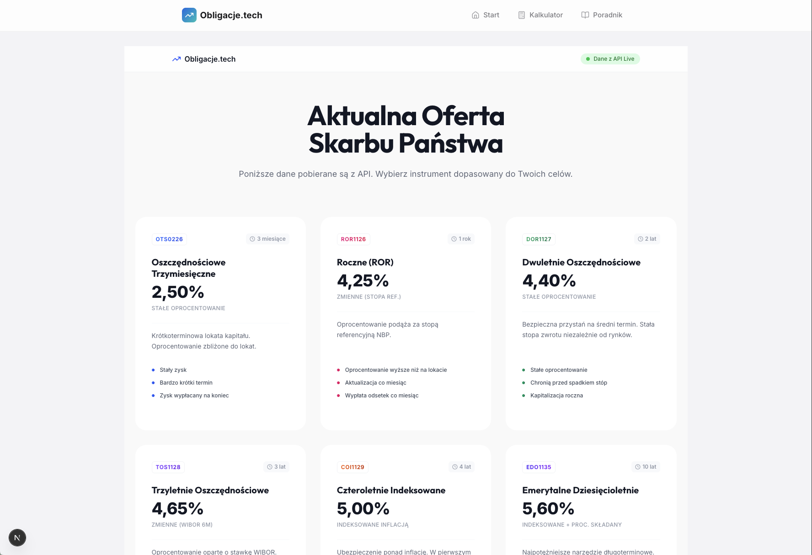

# Obligacje.tech — Polish Treasury Bonds Calculator


A full-stack web application for simulating and analyzing profits from Polish Treasury Bonds (OTS, DOS, TOZ, COI, EDO). Provides precise net profit calculations with compound interest, capital gains tax (Belka tax), and inflation indexing applied.

[](https://nextjs.org/)
[](https://www.typescriptlang.org/)
[](https://spring.io/projects/spring-boot)
[](https://openjdk.org/)

---

## Features

### Profit Calculator

Simulates daily, monthly, and yearly returns using compound interest logic. Accounts for capitalization periods specific to each bond type.


### Data Visualization

Custom SVG chart implementation — linear growth chart and ROI pie chart — built without external chart libraries.




### Market Data Integration

Real-time data from the NBP API, including FX rates and gold prices.



### Educational Hub

Interactive knowledge base covering bond types, taxation, and investment strategies.




### Security

Rate limiting via Bucket4j (token-bucket algorithm) and strict input validation on all calculation endpoints.

---

## Tech Stack

**Frontend**

- Next.js 16.1.2 (App Router)
- TypeScript
- Tailwind CSS
- Lucide React
- Custom SVG Charts — zero external dependencies

**Backend**

- Java Spring Boot 3.2
- Maven
- Bucket4j — rate limiting
- Spring Validation
- JSON-based storage

---

## Architecture

REST API with full decoupling between backend and presentation layer.

| Concern          | Implementation                                    |
| ---------------- | ------------------------------------------------- |
| API Design       | RESTful, versioned endpoints                      |
| Rate Limiting    | Token-bucket algorithm (Bucket4j)                 |
| CORS             | Configured for local and production environments  |
| Input Validation | Spring Validation with unified error responses    |
| Error Handling   | Consistent JSON error schema across all endpoints |

---

## Running Locally

**Prerequisites:** Node.js 18+, JDK 17+, Maven

**1. Backend**

```bash
cd backend
mvn clean spring-boot:run
# Runs on http://localhost:8080
```

**2. Frontend**

```bash
cd frontend
echo "NEXT_PUBLIC_BACKEND_URL=http://localhost:8080/api" > .env.local
npm install
npm run dev
# Runs on http://localhost:3000
```

---

## Purpose

Built as a portfolio project to demonstrate:

- Full-stack application design with separated concerns
- Financial domain logic (compound interest, tax calculations, inflation indexing)
- Backend security practices (rate limiting, input validation)
- REST API design
- Frontend data visualization without third-party chart libraries

---

## Author

**Bartłomiej Neumann**  
[GitHub](https://github.com/bartlomiejneumann) · [LinkedIn](https://linkedin.com/in/bartlomiejneumann)
